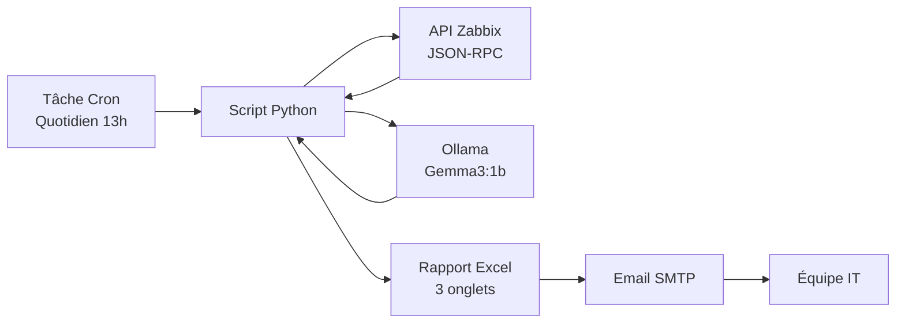
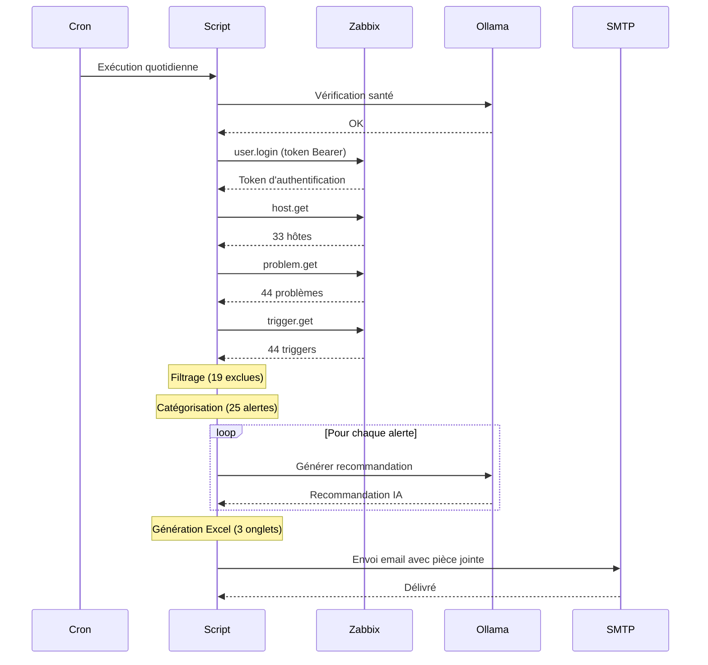

# Rapport Automatisé Zabbix avec Recommandations IA Locale

> Rapport quotidien de supervision Zabbix automatisé avec filtrage intelligent, catégorisation et recommandations IA générées en local via Ollama/Gemma3.


## Présentation

Ce projet automatise la génération d'un rapport de supervision Zabbix envoyé quotidiennement par email. Au lieu de consulter le dashboard manuellement, l'équipe IT reçoit chaque jour un rapport Excel structuré contenant :

- **Indicateurs clés** (hôtes, disponibilité, alertes, bruit filtré)
- **Problèmes catégorisés** (Serveurs, Réseau, Postes de travail, Périphériques)
- **Recommandations IA** pour chaque problème, générées en local avec Ollama
- **Inventaire des hôtes** avec statut de disponibilité
- **Alertes filtrées** avec raison d'exclusion

Tout le traitement IA est effectué **en local** — aucune donnée ne sort du réseau.

## Architecture



## Fonctionnalités

### Filtrage intelligent
Le script exclut automatiquement les alertes non pertinentes :
- Sévérité "Information" et "Non classé"
- Changements de vitesse Ethernet
- Événements Google Updater
- Changements de paquets installés

### Catégorisation automatique
Les problèmes sont classés par type d'équipement en fonction du nom d'hôte et du type d'agent :

| Catégorie | Couleur | Exemples |
|-----------|---------|----------|
| Serveurs | Bleu | Serveurs Linux/Windows |
| Réseau | Orange | Switches, points d'accès |
| Postes de travail | Vert | Postes utilisateurs |
| Périphériques | Violet | Imprimantes |

### Recommandations IA
Chaque problème est envoyé à un LLM local (Gemma3 1B via Ollama) qui génère une recommandation concrète en 2-3 phrases. Exemples :

| Problème | Recommandation IA |
|----------|-------------------|
| Espace disque critique (>90%) | Vérifier et nettoyer /var/log. Envisager d'étendre la partition avec LVM. |
| Agent Zabbix indisponible | Vérifier si le service agent tourne. Redémarrer avec systemctl restart zabbix-agent. |
| Interface link down | Vérifier la connexion physique du câble. Contrôler le port du switch. |

### Rapport Excel (3 onglets)

**Onglet 1 — Rapport quotidien**
- Tableau de bord KPI (hôtes, disponibilité, alertes, filtrées)
- Section "Points d'attention" pour les alertes critiques
- Problèmes groupés par catégorie avec couleurs de sévérité et recommandations IA

**Onglet 2 — Inventaire des hôtes**
- Liste complète des équipements supervisés
- Adresse IP, type d'agent, groupes, état, disponibilité
- Code couleur par disponibilité (rouge = indisponible, gris = désactivé)

**Onglet 3 — Alertes filtrées**
- Événements exclus avec raison d'exclusion
- Permet de vérifier que le filtrage ne masque pas un problème important

## Prérequis

- Python 3.10+
- Serveur Zabbix 7.x avec accès API
- Ollama avec un modèle de langage
- Serveur SMTP pour l'envoi d'emails

## Installation

### 1. Installer les dépendances

```bash
pip3 install openpyxl --break-system-packages
```

### 2. Installer Ollama et télécharger le modèle

```bash
curl -fsSL https://ollama.com/install.sh | sh
ollama pull gemma3:1b
```

### 3. Créer un compte API dédié dans Zabbix

Dans Zabbix : **Administration → Utilisateurs → Créer un utilisateur**
- Nom d'utilisateur : `rapport-auto`
- Rôle : Super admin role (accès lecture API)
- Groupe : Zabbix administrators

### 4. Déployer le script

```bash
mkdir -p /chemin/vers/rapports
cp zabbix_rapport_auto.py /chemin/vers/rapports/
```

### 5. Configurer

Modifier les variables de configuration en haut du script :

```python
# API Zabbix
ZABBIX_URL = "https://votre-serveur-zabbix/api_jsonrpc.php"
ZABBIX_USER = "rapport-auto"
ZABBIX_PASS = "VotreMotDePasse"

# SMTP
SMTP_SERVER = "smtp.votre-fournisseur.com"
SMTP_PORT = 587
SMTP_USER = "votre-compte-smtp"
SMTP_PASS = "votre-mot-de-passe-smtp"
SMTP_FROM = "Zabbix Alertes <alertes@votre-domaine.com>"
EMAIL_TO = ["admin@votre-domaine.com"]

# Ollama (IA locale)
OLLAMA_URL = "http://127.0.0.1:11434/api/generate"
OLLAMA_MODEL = "gemma3:1b"

# Dossier des rapports
REPORT_DIR = "/chemin/vers/rapports"
```

### 6. Tester

```bash
# Tester l'envoi email uniquement
python3 zabbix_rapport_auto.py --test-email

# Générer le rapport sans envoyer par email
python3 zabbix_rapport_auto.py --no-email

# Exécution complète (génération + envoi)
python3 zabbix_rapport_auto.py
```

### 7. Planifier avec cron

```bash
crontab -e
# Ajouter cette ligne (exécution quotidienne à 13h) :
0 13 * * * /usr/bin/python3 /chemin/vers/rapports/zabbix_rapport_auto.py >> /chemin/vers/rapports/cron.log 2>&1
```

## Personnalisation

### Règles de filtrage

Ajouter des patterns à exclure dans `EXCLUDED_PATTERNS` :

```python
EXCLUDED_PATTERNS = [
    r"Ethernet has changed to lower speed",
    r"Operating system description has changed",
    r"GoogleUpdater",
    r"Number of installed packages has been changed",
]
```

### Classification des hôtes

Modifier `classify_host()` pour correspondre à votre convention de nommage :

```python
NETWORK_KEYWORDS = ["aruba", "hp-2530", "switch"]
```

### Modèle IA

Vous pouvez utiliser n'importe quel modèle compatible Ollama. Les modèles légers sont plus rapides, les plus lourds donnent de meilleures recommandations :

| Modèle | Taille | Vitesse | Qualité |
|--------|--------|---------|---------|
| gemma3:1b | 1B | Rapide | Bonne |
| gemma3:4b | 4B | Moyenne | Meilleure |
| llama3.2:3b | 3B | Moyenne | Bonne |
| mistral:7b | 7B | Lente | Excellente |

## Fonctionnement détaillé



## Détails techniques

- **API Zabbix** : JSON-RPC avec authentification Bearer token (Zabbix 7.x)
- **SSL** : Support des certificats auto-signés (configurable)
- **IA** : Inférence locale via l'API HTTP Ollama, température 0.3, max 150 tokens par recommandation
- **Excel** : Généré avec openpyxl, mis en forme avec couleurs, bordures et mise en forme conditionnelle
- **Email** : SMTP avec STARTTLS, support de plusieurs destinataires

## Sécurité

- Tout le traitement IA est effectué en local — **aucune donnée ne sort du réseau**
- Compte API dédié avec permissions minimales
- SMTP avec chiffrement TLS
- Pas de données sensibles dans le rapport (uniquement noms d'hôtes et descriptions de problèmes)

## Licence

Licence MIT — n'hésitez pas à adapter pour votre propre infrastructure.
