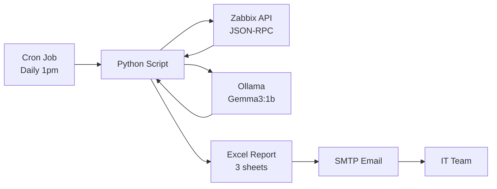
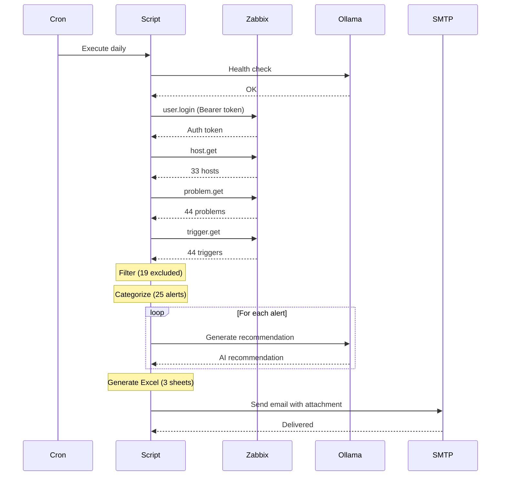

# Zabbix Automated Report with Local AI Recommendations

> Automated daily supervision report for Zabbix with intelligent filtering, categorization, and AI-powered recommendations using a local LLM (Ollama/Gemma3).


## Overview

This project automates the generation of a daily Zabbix supervision report sent by email. Instead of checking the Zabbix dashboard manually, the IT team receives a structured Excel report every day with:

- **Key metrics** (hosts, availability, alerts, filtered noise)
- **Categorized problems** (Servers, Network, Workstations, Peripherals)
- **AI recommendations** for each problem, generated locally with Ollama
- **Host inventory** with availability status
- **Filtered alerts** with exclusion reasons

All AI processing is done **locally** — no data leaves the network.

## Architecture



## Features

### Intelligent Filtering
The script automatically excludes noise alerts that clutter the dashboard:
- Severity "Information" and "Not classified"
- Ethernet speed changes
- Google Updater events
- Package installation changes

### Automatic Categorization
Problems are classified by equipment type based on host name and agent type:
| Category | Color | Examples |
|----------|-------|---------|
| Servers | Blue | Linux/Windows servers |
| Network | Orange | Switches, access points |
| Workstations | Green | User desktops |
| Peripherals | Purple | Printers |

### AI Recommendations
Each problem is sent to a local LLM (Gemma3 1B via Ollama) that generates a concrete recommendation in 2-3 sentences. Examples:

| Problem | AI Recommendation |
|---------|-------------------|
| Disk space critically low (>90%) | Check and clean /var/log. Consider extending the partition with LVM. |
| Zabbix agent unavailable | Check if the agent service is running. Restart with systemctl restart zabbix-agent. |
| Interface link down | Verify the physical cable connection. Check switch port status. |

### Excel Report (3 Sheets)

**Sheet 1 — Daily Report**
- KPI dashboard (hosts, availability, alerts, filtered)
- "Points of Attention" section for high/critical alerts
- Problems grouped by category with severity colors and AI recommendations

**Sheet 2 — Host Inventory**
- Complete list of monitored hosts
- IP address, agent type, groups, status, availability
- Color-coded by availability (red = unavailable, gray = disabled)

**Sheet 3 — Filtered Alerts**
- Excluded events with exclusion reason
- Allows verification that filtering doesn't hide important issues

## Prerequisites

- Python 3.10+
- Zabbix Server 7.x with API access
- Ollama with a language model
- SMTP server for email delivery

## Installation

### 1. Install dependencies

```bash
pip3 install openpyxl --break-system-packages
```

### 2. Install Ollama and pull the model

```bash
curl -fsSL https://ollama.com/install.sh | sh
ollama pull gemma3:1b
```

### 3. Create a dedicated Zabbix API user

In Zabbix: **Administration → Users → Create user**
- Username: `rapport-auto`
- Role: Super admin role (API read access)
- Group: Zabbix administrators

### 4. Deploy the script

```bash
mkdir -p /path/to/reports
cp zabbix_rapport_auto.py /path/to/reports/
```

### 5. Configure

Edit the configuration section at the top of the script:

```python
# Zabbix API
ZABBIX_URL = "https://your-zabbix-server/api_jsonrpc.php"
ZABBIX_USER = "rapport-auto"
ZABBIX_PASS = "YourSecurePassword"

# SMTP
SMTP_SERVER = "smtp.your-provider.com"
SMTP_PORT = 587
SMTP_USER = "your-smtp-user"
SMTP_PASS = "your-smtp-password"
SMTP_FROM = "Zabbix Alerts <alerts@your-domain.com>"
EMAIL_TO = ["admin@your-domain.com"]

# Ollama (local AI)
OLLAMA_URL = "http://127.0.0.1:11434/api/generate"
OLLAMA_MODEL = "gemma3:1b"

# Report directory
REPORT_DIR = "/path/to/reports"
```

### 6. Test

```bash
# Test email only
python3 zabbix_rapport_auto.py --test-email

# Generate report without sending email
python3 zabbix_rapport_auto.py --no-email

# Full run (generate + send)
python3 zabbix_rapport_auto.py
```

### 7. Schedule with cron

```bash
crontab -e
# Add this line (runs daily at 1pm):
0 13 * * * /usr/bin/python3 /path/to/reports/zabbix_rapport_auto.py >> /path/to/reports/cron.log 2>&1
```

## Customization

### Filtering rules

Add patterns to exclude in `EXCLUDED_PATTERNS`:

```python
EXCLUDED_PATTERNS = [
    r"Ethernet has changed to lower speed",
    r"Operating system description has changed",
    r"GoogleUpdater",
    r"Number of installed packages has been changed",
]
```

### Host classification

Modify `classify_host()` to match your naming convention:

```python
NETWORK_KEYWORDS = ["aruba", "hp-2530", "switch"]
```

### AI model

You can use any Ollama-compatible model. Lighter models are faster, heavier models give better recommendations:

| Model | Size | Speed | Quality |
|-------|------|-------|---------|
| gemma3:1b | 1B | Fast | Good |
| gemma3:4b | 4B | Medium | Better |
| llama3.2:3b | 3B | Medium | Good |
| mistral:7b | 7B | Slow | Best |

## How It Works



## Technical Details

- **Zabbix API**: JSON-RPC with Bearer token authentication (Zabbix 7.x)
- **SSL**: Self-signed certificate support (configurable)
- **AI**: Local inference via Ollama HTTP API, temperature 0.3, max 150 tokens per recommendation
- **Excel**: Generated with openpyxl, styled with colors, borders, and conditional formatting
- **Email**: SMTP with STARTTLS, supports multiple recipients

## Security

- All AI processing is done locally — **no data leaves the network**
- Dedicated API user with minimal permissions
- SMTP with TLS encryption
- No sensitive data in the report (only hostnames and problem descriptions)

## License

MIT License — feel free to adapt for your own infrastructure.

## Author

Cybersecurity apprentice — Blue Team / SecOps automation project.
